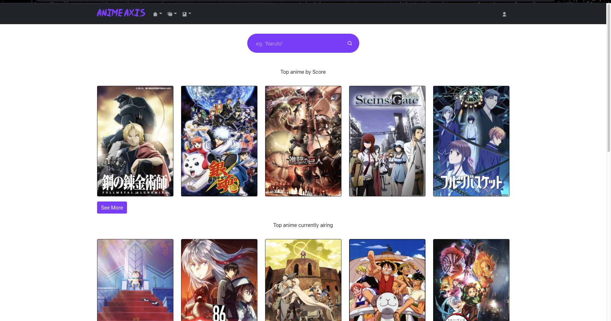
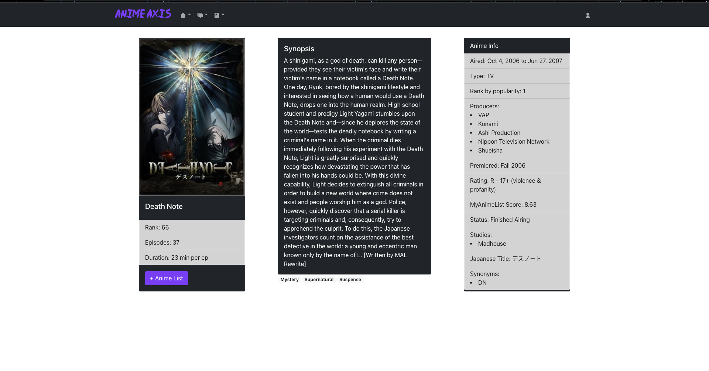
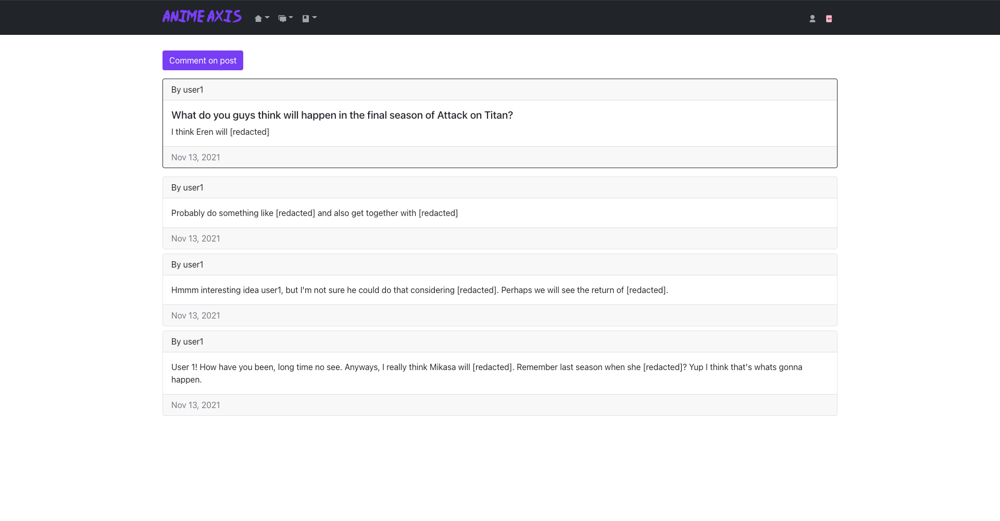
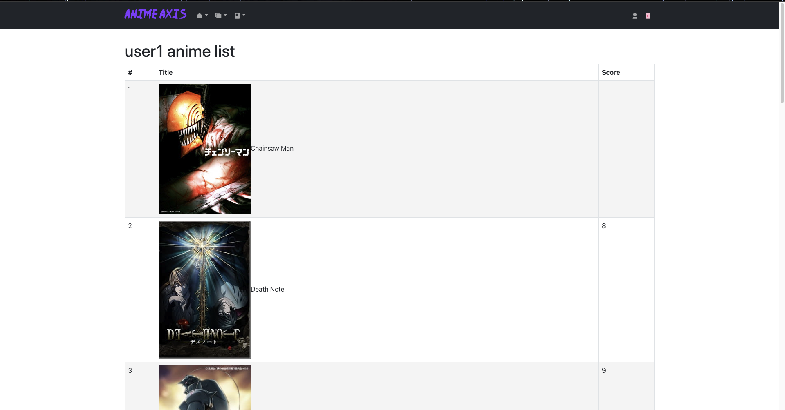

# Anime Axis 
An anime/database and forum for learning and discussing your favorite stories.


## Description

Anime Axis is a place where you can learn all the little details you wish you knew about your favorite anime or manga.



Discuss anime and manga with other people and find out what they are thinking.



You can also keep track of what anime you want to watch and what manga you want to read!



## Install your own copy

Fork and clone this repository.

Then cd into the project directory and run: 
```sh
npm install
npm start 
```

## Environment Setup

Verify you are running a recent version of Node with:

```sh
node -v
```

If your Node version is less than 14, update it with:

```sh
nvm install node
```

You can also update your npm version with:

```sh
npm i -g npm
```

### Built with

<div align="center">


</div>

---

### This Repository contains the frontend for Anime Axis. [The backend can be found here.](https://github.com/Zio-4/anime-axis-api)